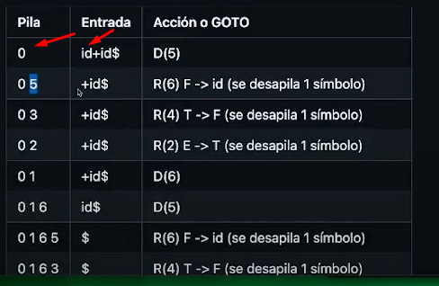
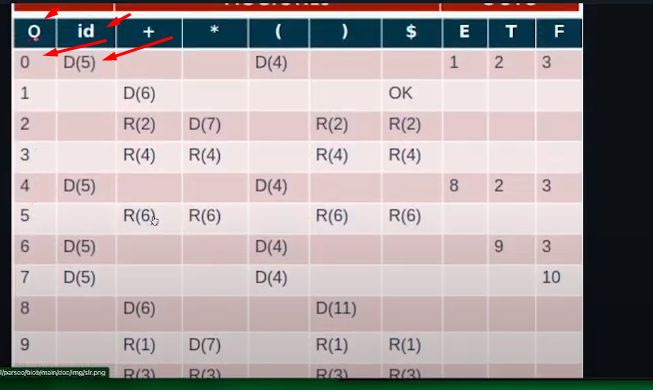
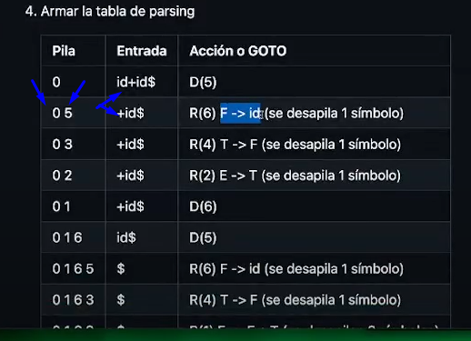
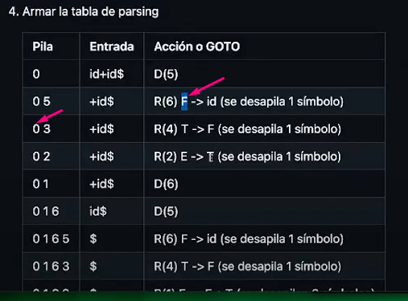
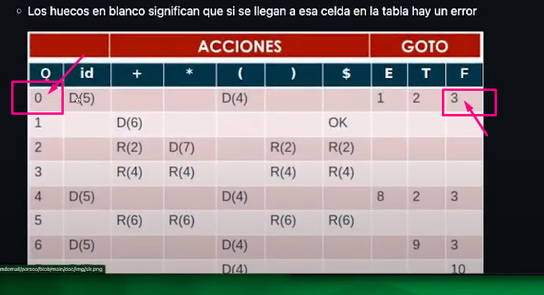
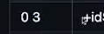
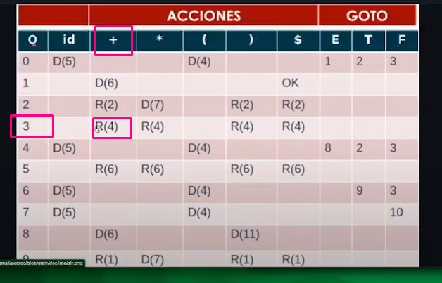
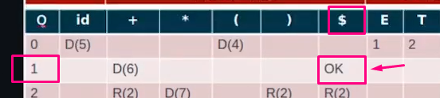

1. [2 puntos] Diséñese el DT para un scanner que reconoce identificadores que inician con una letra, le pueden o no seguir letras o dígitos o guiones bajos. No pueden ocurrir dos guiones bajos seguidos, tampoco pueden aparecer al final de un identificador.

    ```plain
    L ::= [a-zA-Z]
    D ::= [0-9]
    G ::= [_]
    ID ::= L (L | D | G L | G D)*
    ```

     

    | Q   | Letra | Dígito | Guión | Otro     | Token | Retroceso |
    | --  | --    | --     | --    | --       | --    | --        |
    | >q0 | q1    | Error  | Error | Error    | -     | -         |
    | q1  | q1    | q1     | q3    | Error    | -     | -         |
    | *q2 | -     | -      |  -    | -        | ID    | 1         |
    | q3  | q1    | q1     | Error | Error    | -     | -         |
    
    

2. [4 puntos] Constrúyase el parser ASDP LL(1) y 
   muéstrese el parsing para una entrada de longitud mayor a 4.
    Palabras válidas del lenguaje {[], [id], [id,id], [id,id,id], ... }

    ```plain
    L = {[], [id], [id,id], [id,id,id], ... }

    S -> [ A 
    A -> ] | B ]
    B ->  idC 
    C -> λ | ,idC  

    PRIM(S) = {[}
    PRIM(A) = {], id}
    PRIM(B) = {id}
    PRIM(C) = {λ, ','}

    SIG(S) = {$}
    SIG(A) = {$}
    SIG(B) = {]}
    SIG(C) = {]}
    
    PRED(S-> [ A) = {[}
    PRED(A -> ]) = {]}
    PRED(A -> B ]) = {id}
    PRED(B ->  idC) = {id}
    PRED(C -> λ  ) = (PRIM(λ)-{λ}) U SIG(C) = {]}
    PRED(C -> ,idC  ) = { ','}
    ```
    Tabla de ASDP:
    
    Todos los simbolos terminales y $ como columnas y como fila van los no Terminales
    
    | VN | [            | id            |    ]      |   ','     |   $    |
    | -- |   --         | --            | --        | --        | --     |
    | S  |   S-> [ A    | Error         | Error     | Error     | error  |
    | A  |   Error      | A -> B ]      | A -> ]    | Error     | error  |
    | B  |   Error      | B ->  idC     |  Error    | Error     | error  |
    | C  |   Error      | Error         | C -> λ    | C -> ,idC |error   |

    Tabla de parsing:
    
    Se hace $S siempre $ seguido del axioma en este caso S
    Chequeo en el puntero de la pila si tengo esa entrada en la producción.
    Tambien podes emparejar sacando del tope de la pila y
    correr el tope a la entrada.
    
    | Pila   |   Cadena        | Regala o Acción       |
    | --     |   --            | --                    |
    | $S     |   [id,id]$      |  S-> [ A              |
    | $[A    |   [id,id]$      |  Emparejar([)         |
    | $A     |   id,id]$       |  A -> B ]             |
    | $]B    |   id,id]$       |  B ->  idC            |
    | $]Cid  |   id,id]$       |  Emparejar(id)        |
    | $]C    |   ,id]$         |  Emparejar(,)         |
    | $]C    |   id]$          |   C -> λ              |
    | $]     |   id]$          |   Emparejar(id)       |
    | $]     |   ]$            |   Emparejar(])        |
    | $      |   $             |   Accept              |


3. [4 puntos] Constrúyase el parser ASAP SLR y muéstrese 
   el parsing para la entrada [[][]]. 

   Palabras válidas del lenguaje {[], [[]], [][], [[][]], ... }

    Gramatica:

    S -> [] | [S] | SS
    
    S' -> S

    R1 S-> []
    R2 S -> [S]
    R3 S -> SS
   
   Tabla SLR:

   |  Estado	| [   |	]     |  $  |	S  |
   |--------   |-----|------  |-----|-----|
   |  0        |D(1)	|   	   |     |	2  |
   |  1        |D(1)	|D(3)	   |     |	2  |
   |  2		   |     |R(2)	   |R(2)	|  3  |
   |  3		   |     |R(3)    |R(3) |     | 
   |  4		   |     |Aceptar |     | 		|   


   Tabla Parsing:

| Pila     | Entrada   | Acción                    |
|----------|-----------|---------------------------|
| 0        | `[[][]]$` | D(1) (Desplazar `[`)      |
| 0 1      | `[][]]$`  | D(1) (Desplazar `[`)      |
| 0 1 1    | `[]]$`    | D(1) (Desplazar `[`)      |
| 0 1 1 1  | `]]$`     | R(2) (Reducir `S → []`)   |
| 0 1 2    | `]]$`     | R(2) (Reducir `S → [S]`)  |
| 0 2      | `]$`      | D(3) (Desplazar `]`)      |
| 0 2 3    | `$`       | R(3) (Reducir `S → SS`)   |
| 0        | `$`       | Accept                    |

 ```
Aqui un ejemplo de la clase guía:
```
   Tabla Parser la armo mediante la tabla anterior.
   En la pila siempre vas agregando/apilando a la derecha un dato este dato lo sacas de la primera tabla
   
   Aqui estoy yendo a buscar a la tabla 0 de la pila y luego el primer id de la entrada, esto lo voy a buscar a la otra tabla, una vez que identifico esa columna y veo que hace o a que R llama.

   
   Como podemos ver en la otra tabla 0 en la columna id tiene D(5). Entonces debo agregar el 5 a la proxima linea:
   
   apilo ese 5 en la segunda fila y elimino el id de la izquierda que ya use en la columna de la Entrada.

   Ahora tengo que desapilar un simbolo de la pila, es decir el último que es el 5.
   Entonces escribo solo el 0 y tomo de la columna anterior de la accion GOTO el numero que se deriva, es decir 0 de la pila y F  de la accion GOTO seria 0f lo que voy a ir a buscar ahora a la otra tabla.
   
   

    Ahora voy a buscar el 3 que ingrese en la pila y el primer "+"  de la columna
    
    Ubico 3+ = R4
    
    R4 ES ESTA PRODUCCION 
    Entonces desapilo 1 simbolo..
    Sigo este orden hasta que obtengo 1$ que me da el accept.
    