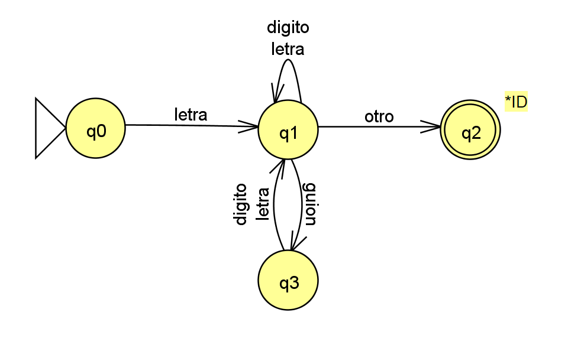

1. [2 puntos] Diséñese el DT para un scanner que reconoce identificadores que inician con una letra, le pueden o no seguir letras o dígitos o guiones bajos. No pueden ocurrir dos guiones bajos seguidos, tampoco pueden aparecer al final de un identificador.

    ```plain
    L ::= [a-zA-Z]
    D ::= [0-9]
    G ::= [_]
    ID ::= L (L | D | G L | G D)*
    ```

     

    | Q   | Letra | Dígito | Guión | Otro     | Token | Retroceso |
    | --  | --    | --     | --    | --       | --    | --        |
    | >q0 | q1    | Error  | Error | Error    | -     | -         |
    | q1  | q1    | q1     | q3    | Error    | -     | -         |
    | *q2 | -     | -      |  -    | -        | ID    | 1         |
    | q3  | q1    | q1     | Error | Error    | -     | -         |
    


2. [4 puntos] Constrúyase el parser ASDP LL(1) y muéstrese el parsing para una entrada de longitud mayor a 4. Palabras válidas del lenguaje {[], [id], [id,id], [id,id,id], ... }

 ```plain

   L = {[], [id], [id,id], [id,id,id], ... }

    S -> [ A 
    A -> ] | B ]
    B ->  idC 
    C -> λ | ,idC  

    PRIM(S) = {[}
    PRIM(A) = {], id}
    PRIM(B) = {id}
    PRIM(C) = {λ, ','}

    SIG(S) = {$}
    SIG(A) = {$}
    SIG(B) = {]}
    SIG(C) = {]}
    
    PRED(A) = {}
    PRED(B) = {}
    PRED(C) = {}
    PRED(D) = {}
    
```


3. [4 puntos] Constrúyase el parser ASAP SLR y muéstrese el parsing para la entrada [[][]]. Palabras válidas del lenguaje {[], [[]], [][], [[][]], ... }

